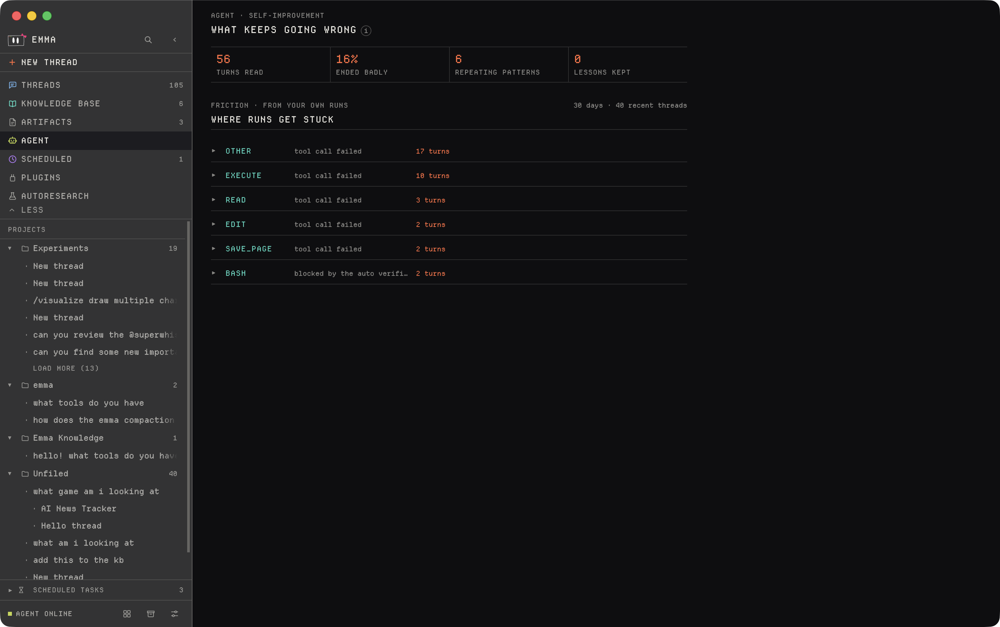
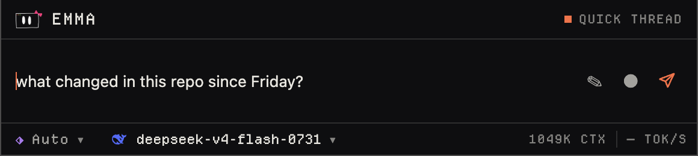
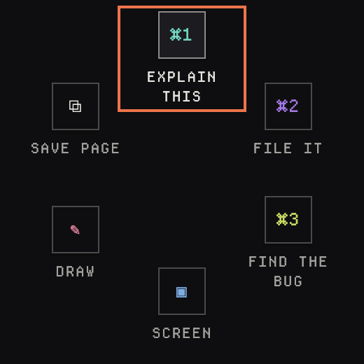
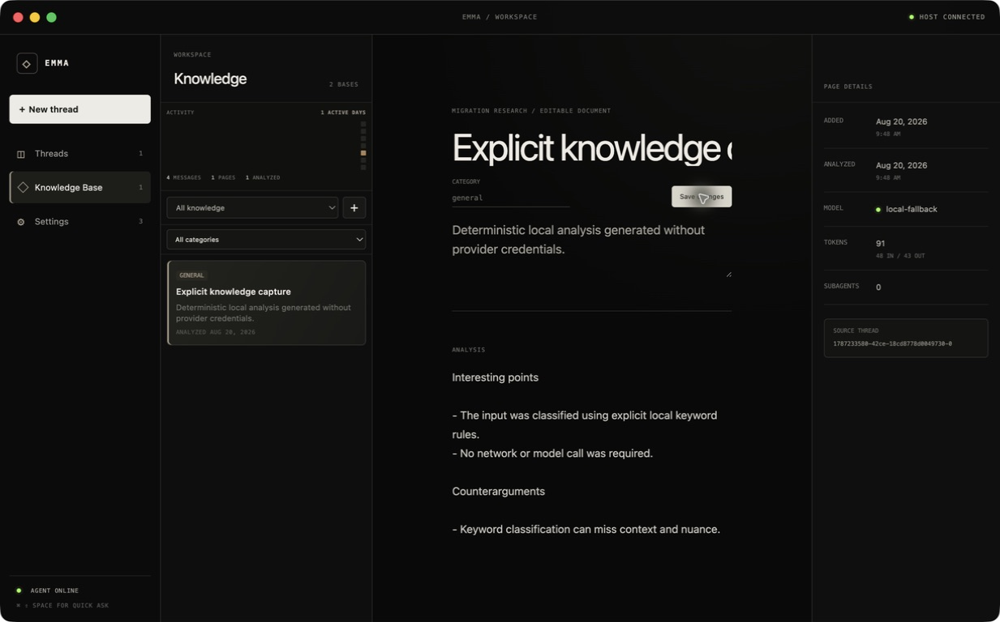

<div align="center">

# Emma

**A macOS agent workspace with an exportable knowledge base.**

Double-tap left Option. Ask. Keep what mattered as Markdown you own.

[](#requirements)
[](desktop/package.json)
[](rust-toolchain.toml)
[](harness/build.zig.zon)
[](desktop/package.json)
[](docs/README.md)



</div>

---

## What Emma is

A global shortcut opens a compact surface at the display notch and starts or
continues a normal agent thread with user-approved context. Saving an analyzed
result as portable Markdown is an explicit action, not the default for every
turn.

- **One loop, every surface.** The thread composer, Quick Ask, a quick action, a page chat, a due scheduled job, and an autoresearch iteration all enter the same interception in Electron main — so exactly one place decides how many steps a turn gets and what has to ask first.
- **A real agent, not a chat box.** It reads and writes files in folders you attach, searches with bundled ripgrep, runs shell commands, drives the screen, calls MCP tools, installs its own skills mid-turn, and spawns subagents.
- **Knowledge you can walk away with.** Every saved page is mirrored as plain Markdown into `~/Documents/Emma Knowledge`, readable without Emma and without knowing her storage format.
- **You hold the permission dial.** Five modes, one table, enforced in the trusted process. `plan` can't touch this Mac; `full` runs unattended; Escape stops a run in every one of them.

## Quickstart

```bash
npm install --prefix desktop
npm run dev
```

Then double-tap the physical **left Option** key to open the compact agent
surface. macOS will ask for Accessibility access so Emma can observe that
modifier-only gesture — the listener discards every other key event.

Without a provider configured, Emma answers from a deterministic local
fallback. To point her at a model, see [Models](#models-and-credentials).

New to the repo? Start at **[docs/getting-started.md](docs/getting-started.md)**.

### Requirements

| | |
|---|---|
| **OS** | macOS on Apple silicon |
| **Node** | 24+ |
| **Rust** | 1.97.1 (`rust-toolchain.toml` pins it) |
| **Zig** | 0.16.0 |
| **Xcode CLT** | `clang` builds the two native helpers |

`npm run dev` builds the Rust host, the Zig sidecar, and the macOS hotkey
helper, then starts Vite and Electron against it. `npm --prefix desktop start`
does the same without the dev server and also vendors ripgrep.

## What a turn can do

The picker beside ＋ chooses how much Emma may do without asking:

| Mode | | What it means |
|---|---|---|
| `plan` | ◇ | Reads and subagents only. Nothing on this Mac changes. |
| `ask` | ◈ | Every write, command, and click asks first. |
| `acceptEdits` | ◆ | File writes and grep go through; other commands and the pointer still ask. |
| `auto` | ⬗ | A separate verifier model reads each gated call; anything it won't clear still asks you. |
| `full` | ⬥ | Nothing asks. Escape still stops a run. |

One table in [`desktop/shared/permissions.ts`](desktop/shared/permissions.ts)
decides what each mode advertises and what it gates — the label you picked and
the check that enforces it can't drift apart. A subagent inherits the mode, so
its writes hit the same table instead of escaping through the spawn.

In the composer, `/` names a capability and `@` names a file. Full tool catalog
and the complete gate matrix: **[docs/permissions.md](docs/permissions.md)** and
**[docs/tools.md](docs/tools.md)**.

### Subagents and sub-threads

Live subagents show in the sidebar under their own color and open in their own
tab, where you can steer or stop them and read their model, rate, tokens, and
tool calls. A `threads` call instead starts a full sub-thread nested under its
parent, with an agent of its own and a card in the transcript to watch it, open
it, stop it, or send it a line.

The inspector carries the turn as a span waterfall, a ledger of what the prompt
actually carried, a Git tab for the connected folder's working tree, and a
`+N −M` diff of everything Emma's own writes touched, with a revert per file.

## The notch surfaces



Emma measures the real camera housing per display through the
`emma-option-tap` helper. Quick Ask is a single island: it takes over the menu
bar on both sides of the housing and hangs below it, centered on the real notch.
Displays without a housing fall back to a validated virtual notch, calibrated in
Settings.

While Emma is idle a click-through sliver sits over the housing; hovering it
reveals a dithered sparkle wave that spills out of the housing itself, and
clicking it opens Quick Ask. Past a bounded height the quick thread scrolls and
Emma offers to continue in the full app. Dismissing an idle overlay destroys its
renderer to release memory while preserving an unsent draft locally.



Three quick actions live in Settings and run from `Command-1/2/3` at any time.
The radial ring orbits the cursor when Quick Ask opens, holding orbs bound to
commands from a fixed catalog that **main validates rather than trusting the
renderer**. Either surface can be switched off.

Details: **[docs/notch.md](docs/notch.md)** · **[docs/voice.md](docs/voice.md)**

## Knowledge



Every thread selects one named knowledge base for writes (the stable
**Default** base covers older data) plus read-only source bases for retrieval.
**Save & analyze** creates an exportable Markdown page inside the selected base;
page edits are separate explicit actions.

Every saved page is also mirrored as ordinary Markdown — YAML front matter and
the document Emma built — into `~/Documents/Emma Knowledge`. `EMMA_KNOWLEDGE_DIR`
moves that folder; an empty value turns the mirror off. **The mirror is derived:
Emma never reads it back.**

Saving a browser page reads it out of whichever whitelisted browser is in front,
keeps its favicon and lead images, and writes it up as a document — summary as
the lede, the figures worth pinning, a chart when the material carries real
numbers, the pictures in one strip, then supporting sections and sources.

Details: **[docs/knowledge.md](docs/knowledge.md)**

## Jobs

A **scheduled job** is a workflow — one validated trigger and a graph of agent,
set, and branch nodes. Triggers are five-field UTC cron, `manual`,
`after <job-id>`, or an app event. Jobs run only while Emma is open, create
normal threads under the permission mode they were saved with, and never save
knowledge or write a skill silently.

An **autoresearch job** is a long-running experiment loop against a git project
on this Mac: the agent proposes one change, Emma runs the eval command, reads
the metric, and keeps or reverts the commit, until a time, token, or spend
budget stops it. The metric is immutable for the life of a job.

Details: **[docs/jobs.md](docs/jobs.md)** · **[docs/autoresearch.md](docs/autoresearch.md)**

## Controlling the Mac

Describe a task under ＋ → Control this Mac and approve the run: Emma captures
the screen, moves the pointer, clicks, and types until the task is done. A
banner sits above every app with the current action and a Stop button, and
Escape aborts from anywhere.

The YOLO toggle in Settings → Privacy skips the approval dialog **and nothing
else** — the step, action, rate, and time ceilings, the action log, the banner,
and Escape stay on either way. A run that hits a dead end or finds a better
route writes itself a skill, so the next one starts knowing what this one
learned.

Details: **[docs/computer-use.md](docs/computer-use.md)**

## Models and credentials

Point Emma at any OpenAI-compatible local or hosted endpoint. The credential
setting names an environment variable and never contains the key:

```bash
export EMMA_PROVIDER_BASE_URL=http://127.0.0.1:1234/v1
export EMMA_PROVIDER_MODEL=your-model
export EMMA_PROVIDER_CREDENTIAL_ENV=EMMA_API_KEY
export EMMA_API_KEY=your-key-or-local-placeholder
```

Settings → Models is the same thing without a shell. A pasted key is encrypted
with the OS keychain under the user's data directory and reaches the host and
its sidecar only through their spawn environment — the renderer gets back a mask
and never the value.

For **OpenRouter**, use the model picker in a thread's composer. Emma loads the
live tool-capable catalog — free and paid, each marked — and browsing it needs
no key, because the listing endpoint is public. Electron caches it and diffs
each reload against the cache, so the picker paints offline; a bundled seed
covers a first launch with neither. Running a model does need a key:

```bash
export OPENROUTER_API_KEY=your-openrouter-key
```

Settings → Privacy has a zero-retention switch: with it on, Emma sends
OpenRouter's `provider.data_collection: "deny"` and `provider.zdr: true` on
every model turn, so a request fails instead of falling back to a provider that
may collect or retain the prompt. It is off by default because OpenRouter has no
free zero-retention endpoint, and requiring one would block the whole free
catalog. Account-level logging settings still apply — review them at
<https://openrouter.ai/settings/privacy>.

Details: **[docs/models.md](docs/models.md)** · **[docs/privacy.md](docs/privacy.md)**

## Extending Emma

First launch and Settings can register existing Codex, Claude, Antigravity, Pi,
OpenCode, Cursor, Windsurf, and Devin skill/MCP locations without copying their
config contents; imported capabilities stay inactive references until selected.
Emma ships her own skills in [`desktop/skills/`](desktop/skills) and owns exactly
two capability files under her user data, so a skill or MCP server she installs
mid-turn is usable in that turn. User-installed CSS plugins can overhaul the
semantic desktop UI.

Settings → Connections lists third-party CLI tools Emma can lean on — `gh`,
`glab`, `jira`, `todoist`, `obsidian-cli`. A connection is a line of system
context and nothing more; the binary was already reachable through `bash`.

Details: **[docs/plugins.md](docs/plugins.md)** · **[docs/cli.md](docs/cli.md)**

### Emma in a terminal

The same agent runs headless. Run this once to get an `emma` command on PATH:

```bash
/Applications/Emma.app/Contents/Resources/emma --install
```

Then `emma "your prompt"`, or bare `emma` for a REPL. It talks to the same
sidecar and provider settings. With a provider configured it advertises exactly
one tool — `bash` — and gates each call on the tty under the same permission
modes the desktop uses. `EMMA_MODE` selects the mode.

### The harness

[`harness/`](harness) is Emma's fork of
[vercel-labs/fx](https://github.com/vercel-labs/fx), built as `emma-cli` and
driven over the Agent Client Protocol from
[`desktop/main/harness.ts`](desktop/main/harness.ts). It owns the agent loop,
tool execution, hooks, skills, and subagents for a turn; Emma owns the window,
the durable Markdown thread, and the answer to every permission question. It is
off by default and opts in with `EMMA_HARNESS=1`.

Provenance and the Apache-2.0 obligations are in
[`harness/FORK.md`](harness/FORK.md).

Details: **[docs/harness.md](docs/harness.md)**

## Documentation

Everything lives in **[`docs/`](docs/README.md)**.

| | |
|---|---|
| [Getting started](docs/getting-started.md) | Install, run, first turn, macOS permissions |
| [Concepts](docs/concepts.md) | Threads, runs, subagents, artifacts, context, the inspector |
| [Architecture](docs/architecture.md) | Process boundaries and the product contract |
| [Permissions](docs/permissions.md) | The five modes and the full gate matrix |
| [Tools](docs/tools.md) | Every tool a turn can call |
| [Models](docs/models.md) | Providers, credentials, the OpenRouter catalog |
| [Privacy](docs/privacy.md) | What leaves this Mac, and what doesn't |
| [Knowledge](docs/knowledge.md) | Bases, save & analyze, the Markdown mirror |
| [Notch surfaces](docs/notch.md) | Quick Ask, the island, orbs, the radial ring |
| [Voice](docs/voice.md) | Dictation engines and drawing |
| [Jobs](docs/jobs.md) | Scheduled workflows, triggers, node graphs |
| [Autoresearch](docs/autoresearch.md) | The experiment loop and its immutable metric |
| [Computer use](docs/computer-use.md) | Driving the Mac, and every safety rail |
| [CLI](docs/cli.md) | The `emma` command and driving other CLIs |
| [Harness](docs/harness.md) | The fx fork, ACP, and what it reaches today |
| [Plugins](docs/plugins.md) | Skills, MCP servers, tools Emma writes, CSS plugins |
| [Design system](docs/design-system.md) | Tokens, density, and the one visual language |
| [Development](docs/development.md) | Repo map, house rules, builds, tests, packaging |
| [Data](docs/data.md) | Every file on disk and every environment variable |
| [Troubleshooting](docs/troubleshooting.md) | When it doesn't work |

[`AGENTS.md`](AGENTS.md) is the source of truth for anyone — human or agent —
changing this repository.

## Repository layout

```text
desktop/        Electron main/preload and React 19 workspace
  main/           lifecycle, windows, shortcuts, trusted IPC, the preload bridge
  src/            sandboxed React views and presentation state — no Node access
  shared/         types and tables both sides agree on
  native/         emma-option-tap and emma-transcribe, built with clang
crates/core/    Durable Markdown knowledge, thread, scheduled and research domain
crates/host/    NDJSON host bridge and Zig sidecar adapter
agent/          Zig agent sidecar, based on fx's embeddable architecture
harness/        emma-cli, Emma's fork of vercel-labs/fx, Apache-2.0
website/        Separate React 19 + Tailwind 4 public site
docs/           Product and architecture contracts
```

Electron owns windows and the sandboxed presentation, Rust owns durable data
and the host boundary, and Zig owns the agent harness:

```text
     sandboxed React renderer
             │  allowlisted IPC
     Electron main / preload
             │  newline-delimited JSON over stdio
     Rust host ──► emma-core ──► Markdown stores
             │
     Zig agent ──► OpenAI-compatible providers and lazy MCP tools
```

## Development

```bash
npm --prefix desktop run check       # test, typecheck, lint, renderer build
cargo test --workspace --locked
zig build test -Doptimize=ReleaseSafe --build-file agent/build.zig
(cd harness && zig build test)
```

The full check list a change has to pass is in [`AGENTS.md`](AGENTS.md); `just
check`, `just test`, and `just package` wrap the rest.
`npm --prefix desktop run build:harness` builds `emma-cli`; nothing else does.

Build a macOS app with `npm run package:mac`.

> **Not release-ready.** `dev.local.emma` is the provisional development
> identity. A publisher-owned bundle ID, a minimum supported macOS version, a
> signing identity, distribution, and an update owner all remain release
> blockers.

More: **[docs/development.md](docs/development.md)**

## License

| | |
|---|---|
| `harness/` | Apache-2.0 — see [`harness/LICENSE`](harness/LICENSE) and [`harness/FORK.md`](harness/FORK.md) |
| `crates/` | Declares `Apache-2.0` in [`Cargo.toml`](Cargo.toml) |
| Departure Mono | SIL Open Font License — [`desktop/assets/DepartureMono-LICENSE.txt`](desktop/assets/DepartureMono-LICENSE.txt) |
| Brand assets | Per [`desktop/assets/BRANDS-NOTICES.md`](desktop/assets/BRANDS-NOTICES.md) and [`docs/icon-sources.md`](docs/icon-sources.md) |

There is no root `LICENSE` file yet; the repository as a whole is unlicensed
until one lands.
