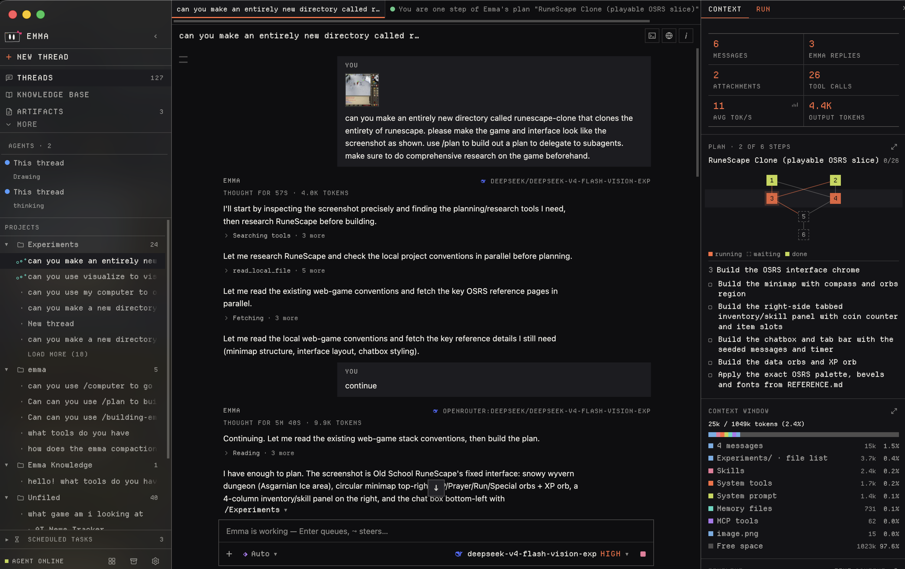
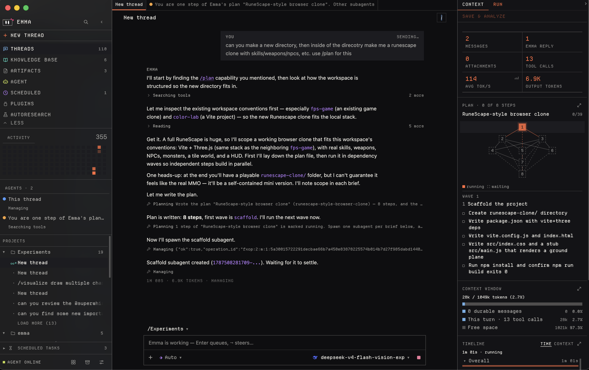
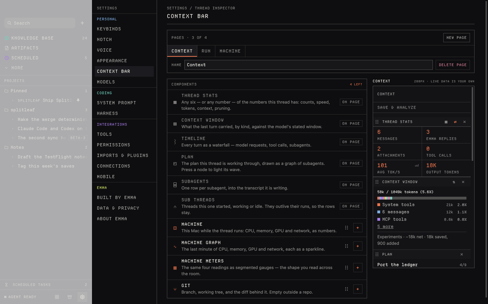
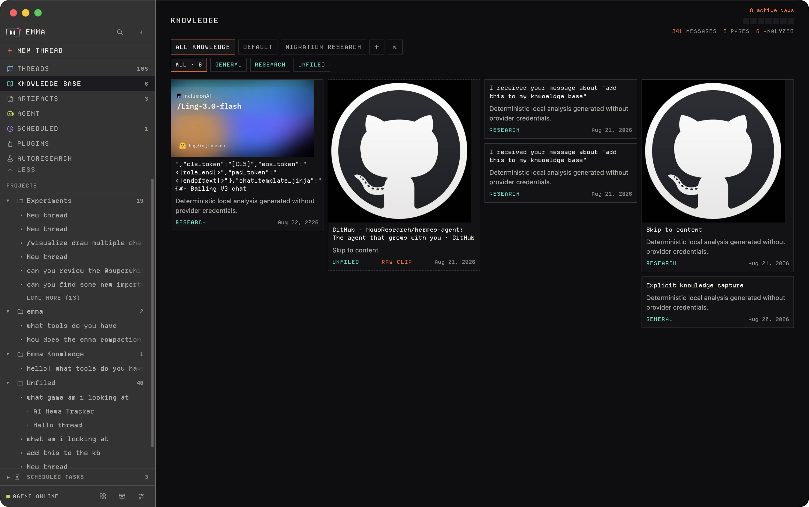
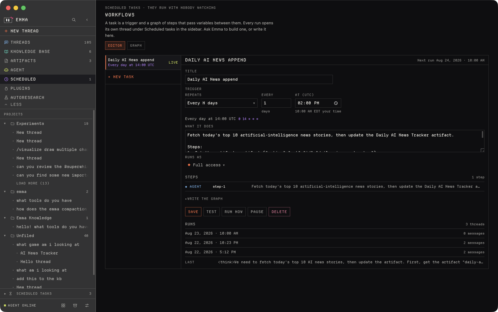
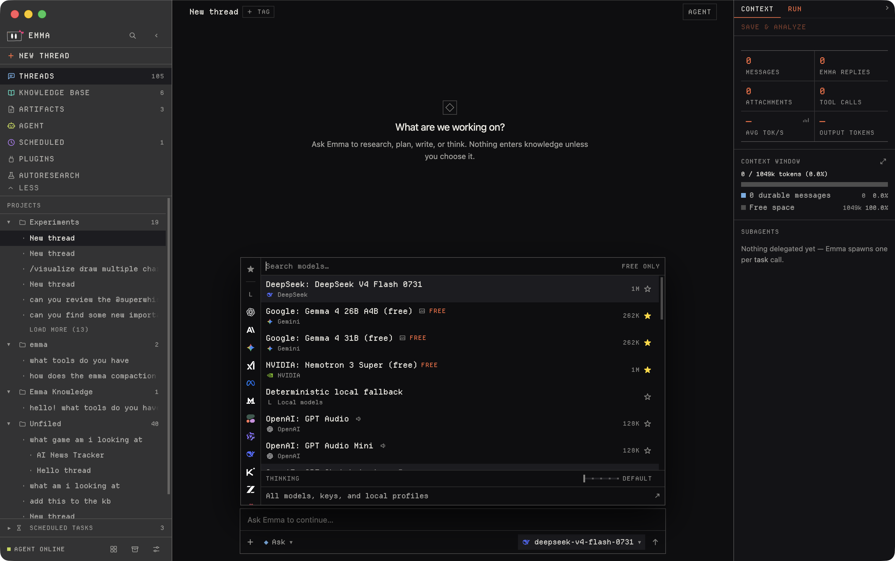

<div align="center">


# Emma

**A macOS agent workspace that keeps what mattered as Markdown you own.**

Double-tap left Option. Ask. Keep the answer in your own vault.

[](#requirements)
[](desktop/package.json)
[](rust-toolchain.toml)
[](harness/build.zig.zon)
[](desktop/package.json)
[](docs/README.md)



</div>

---

## What Emma is

- **One loop, every surface.** The composer, Quick Ask, a quick action, a scheduled job, and an autoresearch iteration all enter the same interception in Electron main — so exactly one place decides how many steps a turn gets and what has to ask first.
- **A real agent.** It reads and writes files in folders you attach, searches, runs shell commands, drives the screen, calls MCP tools, installs its own skills mid-turn, and spawns subagents.
- **Notes you can walk away with.** Every save is one Markdown note in a vault or folder *you* picked. No second copy, no database, readable without Emma.
- **You hold the permission dial.** Four modes, one table, enforced in the trusted process. Escape stops a run in every one of them.

## Quickstart

```bash
npm install --prefix desktop
npm run dev
```

Then double-tap the physical **left Option** key. macOS will ask for Accessibility access so Emma can observe that modifier-only gesture — the listener discards every other key event.

Emma needs a model to answer: there is no offline fallback. Set a key and pick a model in **Settings → Models**, or:

```bash
export OPENROUTER_API_KEY=your-openrouter-key
```

New to the repo? Start at **[docs/getting-started.md](docs/getting-started.md)**.

### Requirements

| | |
|---|---|
| **OS** | macOS on Apple silicon |
| **Node** | 24+ |
| **Rust** | 1.97.1 (`rust-toolchain.toml` pins it) |
| **Zig** | 0.16.0 |
| **Xcode CLT** | `clang` builds three native helpers |

`npm run dev` builds the Rust host, the Zig harness, and the native helpers, then starts Vite and Electron against it. `npm --prefix desktop start` does the same without the dev server.

## What a turn can do

The picker beside ＋ chooses how much Emma may do without asking:

| Mode | | What it means |
|---|---|---|
| `ask` | ◈ | Every write, command, and click asks first. **Default.** |
| `acceptEdits` | ◆ | File edits go through; commands and the pointer still ask. |
| `auto` | ⬗ | A separate verifier model reads each gated call; anything it won't clear still asks you. |
| `full` | ⬥ | Nothing asks. Escape still stops a run. |

One table in [`desktop/shared/permissions.ts`](desktop/shared/permissions.ts) decides what each mode advertises and what it gates, so the label you picked and the check that enforces it can't drift apart. A subagent inherits the mode. Of Emma's 23 tools, seven ever stop to ask: `browser`, `cli`, `computer`, `run_tool`, `install_mcp`, `workflow`, and `autoresearch`.

Emma's own tools are separate from the harness's builtins — file reads and writes, search, shell, and subagents belong to the harness.

Full catalog and the complete gate matrix: **[docs/tools.md](docs/tools.md)** · **[docs/permissions.md](docs/permissions.md)**

### Subagents and sub-threads



`plan` breaks a job into steps and runs the independent ones as parallel subagents. Live subagents show in the sidebar under their own color and open in their own tab, where you can steer or stop them. A `threads` call instead starts a full sub-thread nested under its parent, with an agent of its own.

## Controlling the Mac

Ask for something that needs the screen and Emma reaches for the `computer` tool: it captures the display, moves the pointer, clicks, and types until the task is done.

It is an ordinary tool, so the mode picker decides it. What the mode never changes — there is no switch for any of these:

| | |
|---|---|
| **Ceilings** | 20 steps, 400 actions, 10 minutes per run |
| **Pacing** | 40 ms minimum between actions |
| **Input caps** | 4096 characters typed, 300 s waits, 32 key repeats |
| **Always on** | The banner above every app, the action log, and Escape from anywhere |

Screenshots stay inside Emma's process; the tool answers in text. The `vision` tool is the deliberate exception that sends an image to a model.

Details: **[docs/computer-use.md](docs/computer-use.md)**

## The context bar



The panel down the right of a thread is components you arrange. Seven ship: thread stats, the context-window ledger, the turn timeline, the plan graph, subagents, sub-threads, and Git.

| | |
|---|---|
| **Which, and in what order** | Drag any of the seven in or out; reorder by dragging. |
| **Layout** | Stats, context, subagents, and sub-threads read down the column or across it. |
| **Pages** | Up to four, each named, switched from the bar's own tabs. |
| **Width** | 260–360 px, 288 by default, or a 30 px collapsed rail. |

The arrangement is validated on the way in, so a hand-edited settings file can't produce a bar that won't paint. If none of the seven is what you want, a `code` artifact claiming the `context` surface *becomes* the bar, with the built-in as fallback.

Details: **[docs/context-bar.md](docs/context-bar.md)**

## The notch surfaces


Emma measures the real camera housing per display through the `emma-option-tap` helper. Quick Ask takes over the menu bar on both sides of the housing and hangs below it. Displays without a housing fall back to a validated virtual notch, calibrated in Settings.

While Emma is idle a click-through sliver sits over the housing; hovering reveals a sparkle wave, and clicking opens Quick Ask. Dismissing an idle overlay destroys its renderer to release memory while preserving an unsent draft.


Three quick actions run from `Command-1/2/3`. The radial ring orbits the cursor, holding orbs bound to commands from a fixed catalog that **main validates rather than trusting the renderer**. Either surface can be switched off.

Details: **[docs/notch.md](docs/notch.md)** · **[docs/voice.md](docs/voice.md)**

## Knowledge base



Point Emma at an **Obsidian vault or any plain folder** you already own. The `keep` tool writes one Markdown note per save into `<vault>/knowledge-base`, with attachments alongside and YAML front matter on top. A small model titles and tags it.

There is no mirror and no second copy — the folder you picked *is* the storage, and Emma never reads it back to work. Saving a browser page pulls it out of whichever whitelisted browser is in front, keeping its favicon and lead images.

Details: **[docs/knowledge.md](docs/knowledge.md)**

## Jobs



A **scheduled job** is one validated trigger plus a graph of three node kinds: `agent` runs a prompt, `set` stores a value, `if` branches. Triggers are five-field UTC cron, `manual`, `after <job-id>`, or an app event. Jobs run only while Emma is open, create normal threads under the mode they were saved with, and never keep a note or write a skill silently.

An **autoresearch job** is a long experiment loop against a git project on this Mac: propose one change, run the eval command, read the metric, keep or revert the commit, until a time, token, or spend budget stops it. The metric and its rubric are immutable for the life of the job.

Details: **[docs/jobs.md](docs/jobs.md)** · **[docs/autoresearch.md](docs/autoresearch.md)**

## Models and credentials



Point Emma at any OpenAI-compatible local or hosted endpoint from Settings → Models. The credential setting names an environment variable and never contains the key: a pasted key is encrypted with the OS keychain and reaches the harness only through its spawn environment — the renderer gets back a mask.

For **OpenRouter**, the model picker loads the live tool-capable catalog. Browsing needs no key because the listing endpoint is public; Electron caches it so the picker paints offline, and a bundled seed covers a first launch with neither.

Settings → Models has a **Private routing** switch. With it on, Emma demands endpoints that neither train on nor retain your prompts, so a turn fails rather than quietly routing to a provider that might keep it. It is off by default because no free OpenRouter endpoint qualifies. Account-level logging settings still sit above it — review them at <https://openrouter.ai/settings/privacy>.

Details: **[docs/models.md](docs/models.md)** · **[docs/privacy.md](docs/privacy.md)**

## Extending Emma

First launch and Settings can register existing Codex, Claude, Antigravity, Pi, OpenCode, Cursor, Windsurf, and Devin skill/MCP locations by reference, without copying their config. Emma ships her own skills in [`desktop/skills/`](desktop/skills) and owns two capability files under her user data, so a skill or MCP server she installs mid-turn is usable in that turn. CSS plugins can restyle the UI.

Settings → Connections lists third-party CLIs Emma can lean on — `gh`, `glab`, `jira`, `todoist`, `obsidian-cli`. A connection is a line of system context and nothing more; the binary was already reachable through the shell.

Details: **[docs/plugins.md](docs/plugins.md)** · **[docs/cli.md](docs/cli.md)**

### Emma in a terminal

The same agent runs headless — the harness below, without the window:

```bash
/Applications/Emma.app/Contents/Resources/emma-cli ask "explain this repository"
```

Bare `emma-cli` is a REPL in the current directory; `sessions`, `tasks`, and `permissions` are its other subcommands. Everything it does it gates on the tty under the same permission modes.

### The harness

[`harness/`](harness) is Emma's fork of [vercel-labs/fx](https://github.com/vercel-labs/fx), built as `emma-cli` and driven over the [Agent Client Protocol](https://github.com/zed-industries/agent-client-protocol) from [`desktop/main/harness.ts`](desktop/main/harness.ts). It owns the agent loop, tool execution, hooks, skills, subagents, and the MCP client; Emma owns the window, the durable Markdown thread, and the answer to every permission question. Every turn runs on it — there is no second loop.

Provenance and the Apache-2.0 obligations are in [`harness/FORK.md`](harness/FORK.md).

Details: **[docs/harness.md](docs/harness.md)**

## Credits

Emma is built on other people's work.

> **The fork** — [vercel-labs/fx](https://github.com/vercel-labs/fx), Apache-2.0, © Vercel, Inc. and fx contributors, forked at `580a0c5`, upstream v0.0.4.
> **Vendored** — [ripgrep](https://github.com/BurntSushi/ripgrep) (MIT/Unlicense).
> **Desktop** — [Electron](https://github.com/electron/electron), [React](https://github.com/facebook/react), [TypeScript](https://github.com/microsoft/TypeScript), [Vite](https://github.com/vitejs/vite), [Tailwind CSS](https://github.com/tailwindlabs/tailwindcss), [xterm.js](https://github.com/xtermjs/xterm.js), [Mermaid](https://github.com/mermaid-js/mermaid), [Recharts](https://github.com/recharts/recharts), [dnd kit](https://github.com/clauderic/dnd-kit), [ESLint](https://github.com/eslint/eslint).
> **Rust** — [serde](https://github.com/serde-rs/serde) and its closure.
> **Protocols** — Agent Client Protocol, Model Context Protocol, OpenAI Chat Completions.
> **Font** — [Departure Mono](https://departuremono.com) by Helena Zhang, OFL 1.1.
> **Icons** — [Simple Icons](https://github.com/simple-icons/simple-icons) (CC0), [Lobe Icons](https://github.com/lobehub/lobe-icons) (MIT), [Lucide](https://github.com/lucide-icons/lucide) (ISC), and official vendor kits.
> **Prior art** — [karpathy/autoresearch](https://github.com/karpathy/autoresearch).

Every dependency, its license, and what Emma uses it for: **[docs/credits.md](docs/credits.md)**. Vendor marks: **[docs/icon-sources.md](docs/icon-sources.md)**.

## Documentation

Everything lives in **[`docs/`](docs/README.md)**.

| | |
|---|---|
| [Getting started](docs/getting-started.md) | Install, run, first turn, macOS permissions |
| [Concepts](docs/concepts.md) | Threads, runs, subagents, artifacts, context |
| [Context bar](docs/context-bar.md) | The thread inspector and how to rearrange it |
| [Architecture](docs/architecture.md) | Process boundaries and the trust model |
| [Permissions](docs/permissions.md) | The four modes and the full gate matrix |
| [Tools](docs/tools.md) | Every tool a turn can call |
| [Models](docs/models.md) | Providers, credentials, the OpenRouter catalog |
| [Privacy](docs/privacy.md) | What leaves this Mac, and what doesn't |
| [Knowledge](docs/knowledge.md) | The vault, `keep`, tagging, the note format |
| [Notch surfaces](docs/notch.md) | Quick Ask, the island, orbs, the radial ring |
| [Voice](docs/voice.md) | Dictation engines and drawing |
| [Terminal](docs/terminal.md) | The shell panel under a thread |
| [Jobs](docs/jobs.md) | Scheduled workflows, triggers, node graphs |
| [Autoresearch](docs/autoresearch.md) | The experiment loop and its immutable metric |
| [Computer use](docs/computer-use.md) | Driving the Mac, and every safety rail |
| [CLI](docs/cli.md) | Driving other coding CLIs, and Connections |
| [Harness](docs/harness.md) | The fx fork, ACP, and what it reaches today |
| [Plugins](docs/plugins.md) | Skills, MCP servers, tools Emma writes, CSS |
| [Design system](docs/design-system.md) | Tokens, density, one visual language |
| [Development](docs/development.md) | Repo map, toolchains, builds, tests, packaging |
| [Data](docs/data.md) | Every file on disk and every environment variable |
| [Credits](docs/credits.md) | Every dependency and its license |
| [Troubleshooting](docs/troubleshooting.md) | When it doesn't work |

[`AGENTS.md`](AGENTS.md) is the source of truth for anyone — human or agent — changing this repository.

## Repository layout

```text
desktop/        Electron main/preload and React 19 workspace
  main/           lifecycle, windows, shortcuts, trusted IPC, the preload bridge
  src/            sandboxed React views and presentation state — no Node access
  shared/         types and tables both sides agree on
  native/         emma-option-tap, emma-transcribe and emma-pty, built with clang
crates/core/    Durable Markdown thread, scheduled and research records
crates/host/    NDJSON host bridge
harness/        emma-cli, Emma's fork of vercel-labs/fx, Apache-2.0
website/        Separate React 19 + Tailwind 4 public site
docs/           Product and architecture contracts
```

Electron owns windows and the sandboxed presentation, Rust owns durable data and the host boundary, and Zig owns the agent harness:

```text
     sandboxed React renderer
             │  allowlisted IPC
     Electron main / preload
             ├─ newline-delimited JSON over stdio
             │      Rust host ──► emma-core ──► Markdown stores
             └─ Agent Client Protocol over stdio
                    Zig harness ──► OpenAI-compatible providers and MCP tools
```

## Development

```bash
npm --prefix desktop run check       # test, typecheck, lint, renderer build
cargo test --workspace --locked
(cd harness && zig build test)
```

The full check list a change has to pass is in [`AGENTS.md`](AGENTS.md); `just check`, `just test`, and `just package` wrap the rest. `npm --prefix desktop run build:harness` builds `emma-cli`; nothing else does.

Build a macOS app with `npm run package:mac`.

> **Not release-ready.** `dev.local.emma` is the provisional development identity. A publisher-owned bundle ID, a minimum supported macOS version, a signing identity, distribution, and an update owner all remain release blockers.

More: **[docs/development.md](docs/development.md)**

## License

There is **no root `LICENSE` file**, and the repository as a whole is unlicensed until one lands.

| | |
|---|---|
| `harness/` | Apache-2.0 — [`harness/LICENSE`](harness/LICENSE), [`harness/FORK.md`](harness/FORK.md) |
| `crates/` | Declares `Apache-2.0` in [`Cargo.toml`](Cargo.toml) |
| Departure Mono | SIL Open Font License — [`desktop/assets/DepartureMono-LICENSE.txt`](desktop/assets/DepartureMono-LICENSE.txt) |
| Brand assets | Per [`docs/icon-sources.md`](docs/icon-sources.md) |
