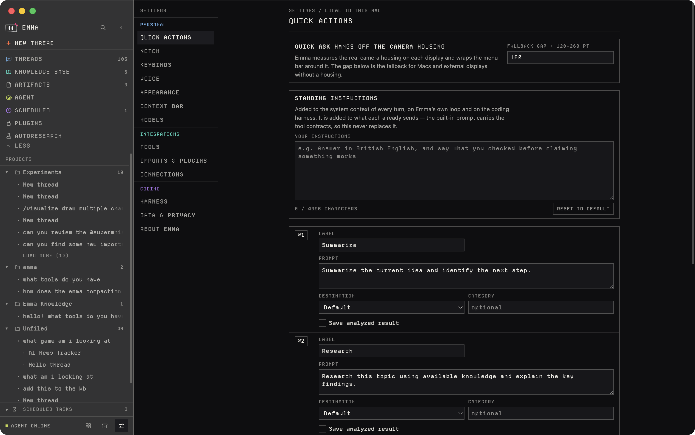
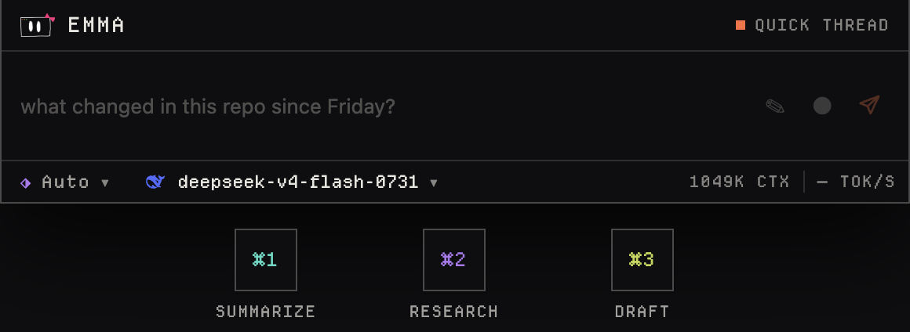

# The notch surfaces

Everything Emma puts at the camera housing: the double-tap gesture that opens it,
the Quick Ask island that wraps the notch, the idle sliver over it, the quick
actions, the ring of orbs around the cursor, and the system-wide keybinds that
reach all of them.

The main-process geometry lives in [overlay.ts](../desktop/main/overlay.ts) and
[main.ts](../desktop/main/main.ts); the AppKit side is
[quick_ask.m](../desktop/native/quick_ask.m); the renderer is the `Overlay`,
`NotchHotspot` and `RadialCommands` components in
[App.tsx](../desktop/src/App.tsx), styled by
[styles/overlay.css](../desktop/src/styles/overlay.css). Visual tokens — colors,
type, spacing, the square-corner rules — are in
[design-system.md](design-system.md) and are not repeated here.

## Double-tap left Option

Press and release the left Option key twice, and the island opens.

This is not an ordinary shortcut. A modifier pressed on its own produces no key
event an app can register — Electron's `globalShortcut` never sees it — so Emma
ships a small AppKit helper that watches the raw event stream instead.
`desktop/native/quick_ask.m` builds to `emma-option-tap` (see the `build:native`
script in [package.json](../desktop/package.json)) and main spawns it at launch
in `startQuickAskHotkey()`.

The helper installs one `NSEvent` global monitor for
`NSEventMaskFlagsChanged | NSEventMaskKeyDown` and discards nearly everything it
sees. `event_input()` in `quick_ask.m` is the whole filter:

| Event | Result |
| --- | --- |
| `NSEventTypeKeyDown` (any key) | `TapCancel` — the gesture resets |
| Flags changed, key code 58, flags exactly `Option` | `TapDown` |
| Flags changed, key code 58, flags exactly 0 | `TapUp` |
| Right Option (key code 61) | `TapCancel` |
| Left Option plus any other modifier | `TapCancel` |
| Anything else | `TapCancel` |

Key code 58 is the *left* Option key specifically. Two down-edges inside **0.35
seconds** print `toggle` on stdout, which main reads and turns into
`toggleOverlay()`. Because a chord or a real keystroke cancels the state
machine, ⌥-clicking, typing ⌥5, or holding Option while dragging never opens
Emma. `quick_ask.m --self-test` asserts all of this and runs as part of
`npm run build:native`, so a build cannot ship a broken gesture.

The helper needs **Accessibility** access. `main()` calls
`AXIsProcessTrustedWithOptions` with the prompt option, so the first launch
raises the System Settings dialog; without the grant the monitor is installed
but macOS delivers it nothing. The grant is described at first launch in
[setup.ts](../desktop/shared/setup.ts) (pane `Privacy_Accessibility`), and Emma
has to be relaunched after it is given. The gesture is the only way into Quick
Ask that never has to be configured — see [Keybinds](#keybinds).

The same binary, run as `emma-option-tap --input`, is the computer-use event
poster; that path is documented in [computer-use.md](computer-use.md).

## Measuring the notch

The camera housing is not in Electron's display record, so main asks AppKit.
`readNotchGeometry()` spawns `emma-option-tap --screens`, which walks
`NSScreen.screens` and, for each one, reads `auxiliaryTopLeftArea`,
`auxiliaryTopRightArea` and `safeAreaInsets.top`. The notch is the gap between
the two auxiliary areas:

```
x     = NSMaxX(left)
width = NSMinX(right) - x
height = safeAreaInsets.top
```

A screen with no housing reports no auxiliary areas and is skipped entirely.
The result is one line of JSON per run, re-read on `display-added`,
`display-removed` and `display-metrics-changed`.

`parseNotchGeometry()` in [overlay.ts](../desktop/main/overlay.ts) treats that
line as untrusted: at most 16 entries, every field finite, width **40–600**
points and height **8–120** points, or the whole array is rejected and Emma
falls back to the configured gap.

### Displays without a housing

Every Mac without a notch — an iMac, an external display, a MacBook Air M1 —
gets a **virtual notch**: a centered band of `notchGap` points. It is validated
in two places, both to the same bounds:

- `validateSettings()` — `notchGap` must be an integer, **120 ≤ n ≤ 260**
- `validateOverlayPreferences()` — the same check on the message that carries it
  to main

The default is **180**. Settings → Quick actions has the field
(`Fallback gap · 120–260 pt`, step 2). The renderer re-validates once more when
it reads the geometry out of its own query string: `readNotchQuery()` accepts
`notchWidth` only in 40–600 and `notchHeight` only in 8–120, falling back to
`settings.notchGap` and 32.

There is no idle sliver on a display without a real housing — see
[The idle sliver](#the-idle-sliver-and-the-wave).

## Quick Ask: one island


Quick Ask is a single window, not a panel beside the notch. It takes over the
menu bar on both sides of the housing and hangs below it, centered on the real
notch. `overlayLayout()` builds it:

| Value | Where | Meaning |
| --- | --- | --- |
| `ISLAND_WIDTH` 620 | overlay.ts | Window width, clamped to `display.width - 16` |
| `ISLAND_INSET` 20 | overlay.ts / `--island-inset` | The island is inset inside its own window so its shadow is not clipped |
| `ISLAND_HEIGHT` 97 | overlay.ts / `.island` | The opaque surface hanging under the housing |
| `ORB_BAND` 126 | overlay.ts | Transparent band below it that the orbs drop into |
| header height | measured | `max(24, menu bar height, notch height)` |

Window height is `header + 97 + 126`. Horizontally the window is centered on the
notch's midpoint and then clamped so it never runs off the display. `overlayLayout`
hands the renderer `notch.left`, `notch.width` and `notch.height` in
window-relative points; they arrive as query parameters and become the
`--notch-x`, `--notch-w`, `--notch-h` CSS variables. `.island-bar` is a
three-column grid — brand, housing gap, status — so the real camera sits in a
column with nothing under it.

### The quick thread

Each exchange hangs under the composer and extends the island. The renderer
measures what is open below the composer — the transcript, the model picker, the
permission-mode band, the `/` menu, and a 60 pt band when a capture is attached —
and asks main for that height.

The cap is **260 points** (`MAX_TRANSCRIPT` in
[overlay.ts](../desktop/main/overlay.ts), mirrored as `MAX_TRANSCRIPT` in
App.tsx and as `.island-thread { max-height: 260px }`). `overlayGrowth()` clamps
whatever the renderer sends to 0–260 before main resizes the window, so a
renderer asking for a screen-tall island cannot get one. Past the cap the
transcript scrolls inside the island instead.

After **6 turns** (`MIGRATE_AFTER`) the island shows a row at the bottom of the
transcript: *"Getting long — continue in the full app →"*, which opens the
workspace.

The island's thread is its own. It is created on the first ask, only this
session's turns render in it, and whatever the thread held before the notch
opened stays there. The transcript streams the same way the workspace does:
answer text as it arrives, tool-call rows under it. Reasoning is deliberately
dropped — two lines of scratchpad would push the answer off a surface this small.

### What the composer carries

- **Enter** sends; **Shift-Enter** is a newline.
- `/` opens built-in tools, imported skills and MCP servers; `@` opens
  artifacts, knowledge pages and the files of granted folders. Nothing is
  attached until the ask is sent — the token is resolved in `send()`.
- The permission-mode picker and the model picker open as *bands* under the
  foot, not popovers, because a popover would be clipped by the window frame.
  The island opens on **Auto**: there is nobody sitting in front of a surface
  that closes on blur, so the verifier answers what it can. See
  [permissions.md](permissions.md).
- The model follows `notchModel` if Settings → Notch pinned one (OpenRouter
  routes only — the host takes no per-thread local profile), otherwise the
  workspace picker's selection. See [models.md](models.md).
- Every turn asked from the notch carries one sentence about what the user had
  in front when it opened. `frontContextNote()` reads it *before* the overlay
  takes the keyboard, because after that the frontmost app is Emma.
- ✎ opens the drawing sheet and ● dictates — both in [voice.md](voice.md).

## The idle sliver and the wave

While Emma is idle a transparent, non-focusable sliver sits over the housing:
`hotspotLayout()` gives it the notch plus **14 points** of margin each side
(`HOTSPOT_PAD`) and **44 points** of drop below the menu bar (`HOTSPOT_DROP`).

It stays **click-through** — `setIgnoreMouseEvents(true, { forward: true })` —
until the cursor is actually inside it, so the menu bar keeps working. Hover is
detected in main, not in the window: a **120 ms** cursor poll compares
`screen.getCursorScreenPoint()` against the bounds, flips
`setIgnoreMouseEvents` and sends `emma:notch-hover`.

The window only *exists* while the cursor is near. A renderer process costs
around 80 MB whatever it draws, and this one draws a hover hint nobody is
looking at most of the time, so main builds it when the cursor comes within
`HOTSPOT_WARM` = **220 points** and destroys it when the cursor leaves or the
island opens. The 220 pt lead covers the ~113 ms the renderer takes to paint.

On hover, `NotchWave` draws **two rows** of dither that spill out of the housing
and down past its bottom edge. A travelling wave decides where the flame is
tall, a per-cell hash makes it flicker, and the ramp is `" ·∙░▒▓"`. Column count
is `max(12, width / 6)`. The hue is CSS: the palette's six colors run across the
flame as a gradient, each mixed halfway into `--text-3` so it reads as embers.
Under `prefers-reduced-motion: reduce` the component never starts its timer, and
the global rule in [index.css](../desktop/src/index.css) kills the CSS animation
too.

Clicking the sliver sends `emma:open-overlay`, which main accepts only from the
hotspot window and only when no overlay exists.

Two more things. The sliver is built for `screen.getPrimaryDisplay()` only, and
only when that display reports a real housing — a virtual notch gets Quick Ask
but no idle affordance. And the wave belongs to the idle surface alone: the
island does not draw one, because once it is open it says "this is a control"
for itself.

## Leaving: chip, pop-out, and destroying the renderer

Escape, or the pointer landing in another app, calls `leaveOverlay()`:

- **Idle, still at the notch** → the window is destroyed. That releases the
  whole renderer process rather than keeping a hidden Chromium around.
- **Anything else** (a turn running, or already off the housing) → it collapses
  to a **chip**.

The chip is 44 points square (`PILL_SIZE`), parked 16 points from the top right
corner (`PILL_MARGIN`) or wherever the user last dragged it, and always clamped
whole inside the work area — a chip half off the screen is one you cannot get
back. It is the same renderer, still holding the turn: colour is the whole
report, accent while it runs, red on error, lime when it lands. A landed chip
fades after **2400 ms** (`PILL_LINGER_MS`) plus a **320 ms** fade
(`PILL_FADE_MS`) and then calls `dismissOverlay()`, which main honours only if
the surface is a chip and nothing is running. A broken one stays put.

Clicking the chip (a press that never travelled — a press that moved is a drag)
opens the island *where the chip stands*: `popoutLayout()` gives it the same 620
pt width, a `POPOUT_BAR` = **28 pt** header instead of a housing to wrap, and
overhangs the chip's left edge by `ISLAND_INSET` so their edges line up.

Closing mid-turn only hides the window; `closeOverlayWhenIdle` destroys it once
`emma:set-overlay-busy` reports the run has settled, so a successful prompt
cannot replay.

### The unsent draft

Destroying the renderer would normally throw away whatever was typed. It does
not, because the draft is not renderer state — it is written to `localStorage`
under **`emma.overlayDraft.v1`** (`OVERLAY_DRAFT_KEY` in
[App.tsx](../desktop/src/App.tsx)) on every keystroke and read back in the
`useState` initialiser on the next open. Sending clears it.

There is a second write on the failure path: if a send throws, the island asks
main for a fresh snapshot and checks `hasPersistedPrompt()`
([drafts.ts](../desktop/src/drafts.ts)) — if the prompt did *not* reach the
thread, the text goes back into the draft and back into the box. If it did, the
draft stays cleared, so a failed *response* never duplicates a delivered
*prompt*.

The store is a plain `file://` `localStorage`, shared with the workspace
renderer. `desktop/src/drafts.ts` holds only the duplicate check, not the
storage.

## Quick actions

Exactly **three**, stored locally. `validateSettings()` throws
`"Exactly three quick actions are required"` on anything else, and the type is a
fixed tuple `[QuickAction, QuickAction, QuickAction]`.



Each action has a label (≤ 40 chars), a prompt (≤ 4096), a destination knowledge
base, an optional category (lowercase kebab, ≤ 64) and a
`Save analyzed result` checkbox. The shipped three are *Summarize*, *Research*
and *Draft*.

**`Command-1` / `Command-2` / `Command-3`** run them at any time the island has
the keyboard — the listener in `Overlay` matches `(metaKey || ctrlKey)` and
`/^[123]$/` and calls `runAction(key - 1)`. They can also be bound system-wide;
see [Keybinds](#keybinds).



In the overlay they stay out of the way. `.command-orbs` sits below the island's
bottom edge at `opacity: 0` with `pointer-events: none` until the pointer swipes
below the island, at which point the three hang under it as orbs and the island
body dims to 30%. `useNotchSwipe()` is what watches for that: the hit region is
a **triangle** that opens downward from the housing to the orb row —

```
drop        = clientY - notch.height
inside      = drop >= bottom - 6 && drop <= bottom + 105
              && |clientX - notchCentre| <= notch.width/2 + 60 + max(0, drop - bottom) * 1.7
```

— so a diagonal swipe toward an orb widens the target instead of losing it.
Leaving the triangle closes the row after 260 ms. `ORB_DROP` is 105. Focusing an
orb with the keyboard also reveals the row (`:focus-within`).

Running an action creates its own thread, points it at the action's destination
knowledge base, sends the prompt, and — if `saveToKnowledge` is set — saves the
answer as a page and applies the category. Whatever is attached to the island
(a drawing or a capture) rides along.

The swipe row can be switched off with `notchCommandsEnabled` in Settings.

## The radial ring


When Quick Ask opens, a second window opens around the cursor: a 260 pt square
(`RADIAL_SIZE`), non-focusable, clamped inside the display, with the orbs laid
out on a circle of radius 88 px starting at 12 o'clock. It does not open when
the island was opened *with* a command already attached, and it closes whenever
the island collapses to a chip.

The ring holds **1 to 8** orbs (`MAX_CURSOR_ORBS` = 8; `validateSettings` rejects
an empty list or more than 8), **six by default**:
`["0", "1", "2", "screen", "draw", "page"]`.

### The catalog

`CURSOR_COMMANDS` in [settings.ts](../desktop/shared/settings.ts) is the whole
list — seven entries:

| Command | Glyph | Name | What it does |
| --- | --- | --- | --- |
| `0` | ⌘1 | Action 1 | Runs quick action index 0 |
| `1` | ⌘2 | Action 2 | Runs quick action index 1 |
| `2` | ⌘3 | Action 3 | Runs quick action index 2 |
| `screen` | ▣ | Screen | Captures the display and attaches it as a one-shot thumbnail |
| `draw` | ✎ | Draw | Opens the drawing sheet ([voice.md](voice.md)) |
| `page` | ⧉ | Save page | Clips the page the front browser has open into knowledge |
| `workspace` | ▤ | Open app | Opens the full workspace |

An orb bound to a quick action takes that action's label; the rest use
`cursorCommandNames`.

Main does not trust the ring. `ipcMain.on("emma:quick-command")` accepts the
message only from the radial window's own main frame, runs it through
`isCursorCommand()`, forwards it to the island and closes the ring. A renderer
that invents a command is ignored.

`voice` also arrives on `emma:quick-command`, but only from main's own
`runOverlayCommand()` on the keybind path — it is not in `CURSOR_COMMANDS` and
cannot be put on an orb.

### Editing it

Settings → Quick actions renders the ring with the same `OrbRing` component the
cursor window uses — a live copy, not a mockup. Picking an orb selects it,
`Orb N runs` rebinds it, and the count field grows or shrinks the array,
filling new slots with the first unused command. Both surfaces have their own
switch: `cursorOrbsEnabled` ("Ring the cursor when Quick Ask opens") and
`notchCommandsEnabled` ("Reveal commands under the island on a swipe"). The ring
switch travels in the validated overlay preferences, so when it is off the
window is never created at all.

## Keybinds

Settings → Keybinds adds system-wide shortcuts. `KEYBIND_ACTIONS` in
[settings.ts](../desktop/shared/settings.ts):

| id | Label | Built in |
| --- | --- | --- |
| `toggle` | Open Quick Ask | ⌥⌥ double-tap left Option |
| `voice` | Quick Ask with voice | — |
| `draw` | Draw on the screen | ✎ on the island |
| `action0` | Quick action 1 | ⌘1 while the island is open |
| `action1` | Quick action 2 | ⌘2 while the island is open |
| `action2` | Quick action 3 | ⌘3 while the island is open |

The `builtin` column is the point: **the double-tap gesture is never taken
away**. An empty row means "no extra shortcut added", not "no way in".

A binding is either a **chord** or a **held modifier**, never both
(`validateKeybinds` throws if both are set).

**Chords** go to Electron's `globalShortcut`. `keybindProblem()` refuses:

- anything not ending in a normal key
- anything with no ⌘/⌃/⌥ ("otherwise it fires while you type")
- ⌘ plus a single key ("belongs to app menus" — ⌘S globally would take Save from
  every app)
- a reserved list macOS already owns: ⌘Space, ⌘Tab, ⌘⇧3/4/5/6, ⌃arrows, ⌘F1–F5
  and the rest of `RESERVED`

`applyKeybinds()` unregisters everything it previously took, re-registers, and
returns the actions the OS refused so Settings can say
*"Another app holds ⌘⌃K. Pick a different one."* Escape is deliberately left
alone — it belongs to the computer-use run banner's kill switch.

**Holds** cannot go to `globalShortcut` at all: a global shortcut is only ever
told about the key going down, and a hold needs both edges. They go to the same
`emma-option-tap` listener, over its stdin, as
`{"holds":[{"id":"voice","keyCode":58,"ms":500}]}`. Only modifiers are holdable
(`HOLD_KEYS`: both Options, Controls, Commands and Shifts, as macOS virtual key
codes) — a held letter autorepeats into whatever is in front, and no global
listener can swallow that. Durations are 300 / 500 / 750 / 1000 ms, default 500;
the native side additionally clamps to 100–5000 ms and 8 bindings
(`kMaxHolds`).

`handle_hold()` arms a binding only when the flags are *exactly* that one
modifier, and bumps a generation counter on every cancel. Releasing, adding a
second modifier, or typing anything under the hold all cancel it — so ⇧ held to
type a long capitalised word never fires, and ⇧⌥ is read as a chord in progress
rather than an ⌥ hold. One report per press.

The recorder in Settings distinguishes the two by waiting: a lone modifier going
down is not yet a binding, and its *release* is what decides whether it was a
hold or the first half of a chord. Recording captures in the capture phase with
`preventDefault` throughout, so the combination being recorded does not also
fire.

A keybind that is not `toggle` runs through `keybindCommands`
(`voice`→`voice`, `draw`→`draw`, `action0`→`0`, …) into `runOverlayCommand()`,
which sends it to the island — opening it first if it is closed. When the island
has to be opened for it, the command rides the **query string** rather than an
IPC message, because there is no renderer subscribed yet.

## Windows, levels and geometry

Every window except the workspace — the island, the sliver, the ring, the
drawing sheet and the computer-use run banner — is built the same way. Each
choice below is load-bearing.

**They are `NSPanel`s.** `const floating = { type: "panel" }` on darwin. This is
the whole difference between "the notch opened" and "Emma opened": a normal
window cannot be shown or focused without activating the application, and
activating an application raises *all* of its windows — which used to drag the
workspace in front of whatever the user was working in.

**Only the workspace calls `show()`.** `load()` uses `showInactive()` + `focus()`
for the overlay and the drawing sheet, and bare `showInactive()` for the sliver,
the ring and the run banner.

**They are above the menu bar.** `setAlwaysOnTop(true, "screen-saver")`, since
the island hangs off the housing and the menu bar is in the way.

**`skipTransformProcessType: true`** on every
`setVisibleOnAllWorkspaces(true, { visibleOnFullScreen: true, … })` call.
Without it that call demotes Emma to an accessory app, costing the main window
its Dock icon and its ⌘-Tab entry.

**All transparent, frameless, shadowless, `roundedCorners: false`** — the
island draws its own outline and its own shadow (`--shadow-lg`), because unlike
an on-page region these windows genuinely float over other apps.

**Every window is a sandboxed renderer** — `secureWindow()` sets
`contextIsolation: true`, `sandbox: true`, `nodeIntegration: false`, blocks
`will-navigate` and routes `window.open` to the external browser.

**Every IPC message from these windows is checked twice** — that it came from
the main frame, and that the sender is the specific window that owns the channel
(`event.sender !== overlay?.webContents` and friends). Screen capture, page
clipping and screen annotation are all "available only from the quick overlay".

Rendering waits for `ready-to-show` with a 2000 ms fallback, because `loadURL`
resolves before Chromium has necessarily laid out at the window's real size.

Reference values, all in points:

| Constant | Value | File |
| --- | --- | --- |
| `ISLAND_WIDTH` | 620 | overlay.ts |
| `ISLAND_HEIGHT` | 97 | overlay.ts |
| `ORB_BAND` | 126 | overlay.ts |
| `ISLAND_INSET` | 20 | overlay.ts |
| `MAX_TRANSCRIPT` | 260 | overlay.ts |
| `PILL_SIZE` / `PILL_MARGIN` | 44 / 16 | overlay.ts |
| `POPOUT_BAR` | 28 | overlay.ts |
| `HOTSPOT_PAD` / `HOTSPOT_DROP` | 14 / 44 | overlay.ts |
| `HOTSPOT_WARM` | 220 | main.ts |
| hover poll | 120 ms | main.ts |
| `RADIAL_SIZE` | 260 | main.ts |
| orbit radius | 88 | App.tsx |
| `ORB_DROP` | 105 | App.tsx |
| `ATTACHMENT_BAND` | 60 | App.tsx |
| `MIGRATE_AFTER` | 6 turns | App.tsx |
| `PILL_LINGER_MS` / `PILL_FADE_MS` | 2400 / 320 | App.tsx |
| double-tap window | 350 ms | quick_ask.m |
| notch geometry limits | width 40–600, height 8–120, ≤ 16 displays | overlay.ts |
| virtual notch | 120–260, default 180 | settings.ts |

## Running a second ask on a busy island

Pressing the shortcut while a turn is still going does one of two things,
per `notchConcurrency` in Settings → Notch:

- **`separate`** (default) — the island comes back empty and the next ask is a
  task of its own. The running turn belongs to main, so it finishes and lands in
  its own thread; only this window's *view* of it ends. An unsent draft is left
  alone.
- **`continue`** — the running thread is reopened, so the next ask reads
  everything already said in it, and waits, because a thread runs one turn at a
  time.

The renderer tracks this with a `session` counter: a turn that lands after the
session moved on writes nothing back into the island.

## Emma can rewrite the island

`notch` is one of the four `ARTIFACT_SURFACES`
([artifacts.ts](../desktop/shared/artifacts.ts)), so the island body is wrapped
in `<Region name="notch">` from [regions.tsx](../desktop/src/regions.tsx). If a
mountable code artifact claims that surface, its module is imported into the
overlay renderer and rendered in place of the built-in, handed
`{ turns, busy, error, stream, status, ask, open }`. A module that throws while
rendering, or will not import, drops back to the built-in island and says why —
a broken notch must never be a window with no way out. See
[architecture.md](architecture.md) for the artifact machinery.

## See also

- [voice.md](voice.md) — dictation, and the ✎ drawing sheet the ring opens
- [permissions.md](permissions.md) — the mode picker in the island's foot
- [models.md](models.md) — pinning the island to its own model
- [knowledge.md](knowledge.md) — where `page` and quick actions save to
- [computer-use.md](computer-use.md) — the other half of `emma-option-tap`
- [design-system.md](design-system.md) — the tokens these surfaces are drawn in
- [architecture.md](architecture.md) — windows, shortcuts, and artifacts
- [troubleshooting.md](troubleshooting.md) — when the gesture does nothing
- [getting-started.md](getting-started.md) · [concepts.md](concepts.md)
